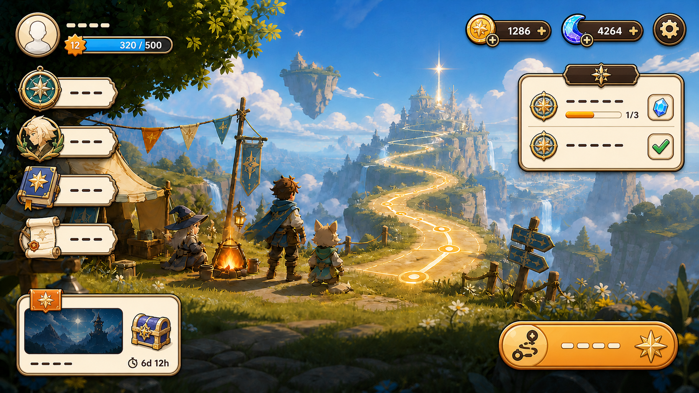
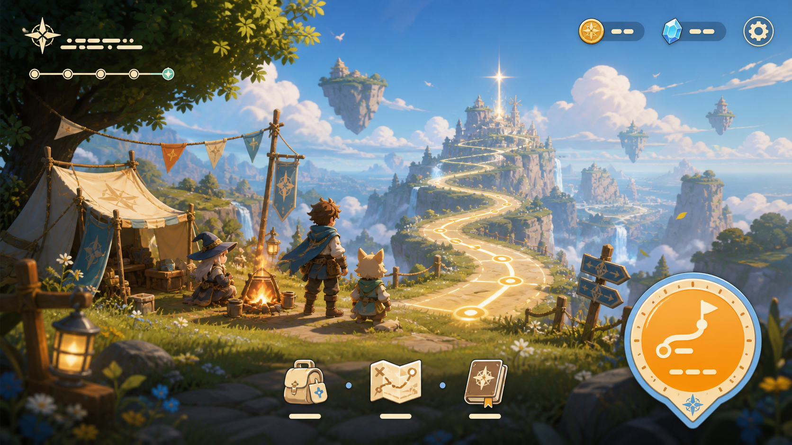

# 大厅 UI 图像归档

先读 [大厅交接](../../../docs/HANDOFF_2026-08-31_LOBBY_UI.md)。这里是历史参考和候选图，不是可直接上线的UI资产包。

## 当前候选与原始基准

最新候选（未验收）：

用户喜欢的初始风格（大圆按钮已否决）：

## 六张规范

- [01：基础](standards/规范1.png)
- [02：导航图标](standards/规范2.png)
- [03：道具与技能图标](standards/规范3.png)
- [04：基础组件](standards/规范4.png)
- [05：组合模块](standards/规范5.png)
- [06：文字与排版](standards/规范6.png)

## 外部参考

- [兔子游戏布局](references/9ccd4e02-1ffd-4d11-aa29-ca6973ca5848.png)
- [城镇任务清单](references/7d39d361-f2c0-4113-8621-4327ff42722b.png)
- [登录页](references/800816e6-acd5-4ddb-9e1b-a654423f2e90.png)
- [英雄详情](references/b93310b9-7df6-4274-a28b-c42117bf6683.png)
- [章节页](references/b19326e0-b16c-4e48-b8e8-dadb80b1aef6.png)
- [龙主题页面](references/a412f60a-d7f0-4a60-9acd-95436777a17c.png)
- [任务列表](references/42c238d3-21da-4b59-9179-64a3ce3cfaa6.png)
- [活动弹窗](references/4c90fd3b-f6e8-4397-9082-4df64cd2f7a5.png)

第三方截图仅为用户提供的视觉分析参考，不作为原创生产资产，也不据此新增对应商业玩法。重复附件与恢复来源见 [manifest.json](manifest.json)。
