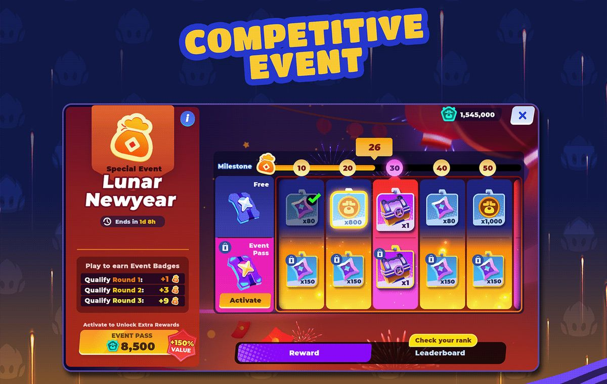
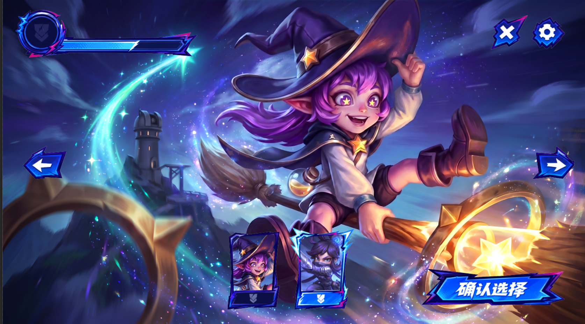
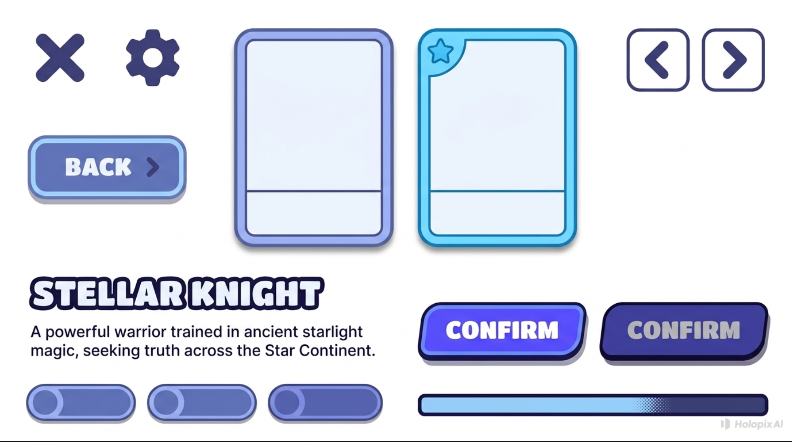
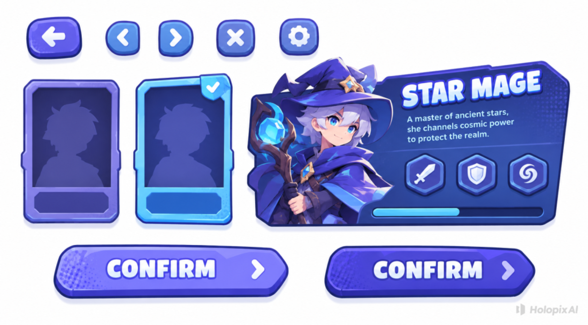

# 2026-09-07 关键美术与 UI 测试图

以下为本次用户提供的资源与测试证据。状态以最新交接为准；外部参考不是生产资产。

| 文件 | 状态 |
|---|---|
| [miluka-splash.jpg](miluka-splash.jpg) | current-art |
| [naisha-splash.jpg](../2026-08-27/character-select/naisha-splash.jpg) | current-art |
| [peko-splash.jpg](../2026-08-27/character-select/peko-splash.jpg) | current-art |
| [yanqiu-splash.jpg](../2026-08-27/character-select/yanqiu-splash.jpg) | current-art |
| [bomu-splash.jpg](../2026-08-27/character-select/bomu-splash.jpg) | current-art |
| [unused-group-art.jpg](unused-group-art.jpg) | former-lobby-purpose-abandoned |
| [electric-ui-sheet.png](electric-ui-sheet.png) | rejected-direction |
| [electric-ui-with-portraits.png](electric-ui-with-portraits.png) | user-too-harsh |
| [colorful-style-reference.png](colorful-style-reference.png) | external-reference-only |
| [rounded-blue-ui-a.png](rounded-blue-ui-a.png) | user-unsatisfactory |
| [rounded-blue-ui-b.png](rounded-blue-ui-b.png) | user-unsatisfactory |

current-art：用户本次提供的现有美宣；不额外声称已完成动画或全部制作验收。
former-lobby-purpose-abandoned：原大厅用途废弃，新用途未定。
rejected-direction / user-too-harsh：电光尖角方向太扎眼。
user-unsatisfactory：蓝紫圆润两稿效果一般。
external-reference-only：仅参考造型、字体、配色节奏，不复制商业功能。

## 当前参考

## 实图测试：用户认为扎眼

## 两张不满意的蓝紫结果

