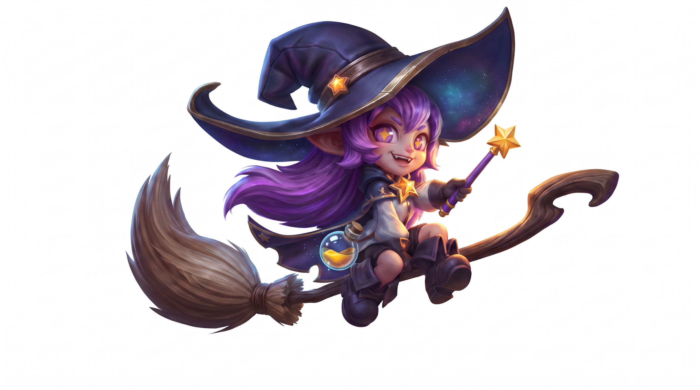
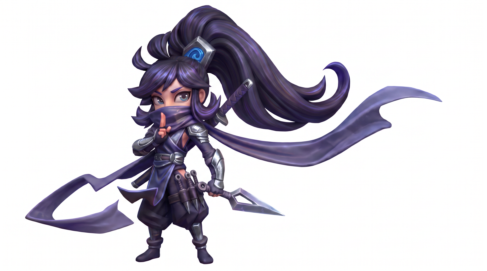
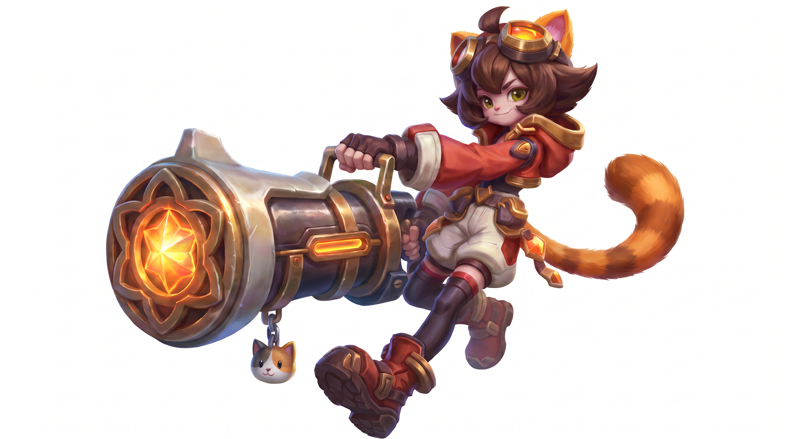
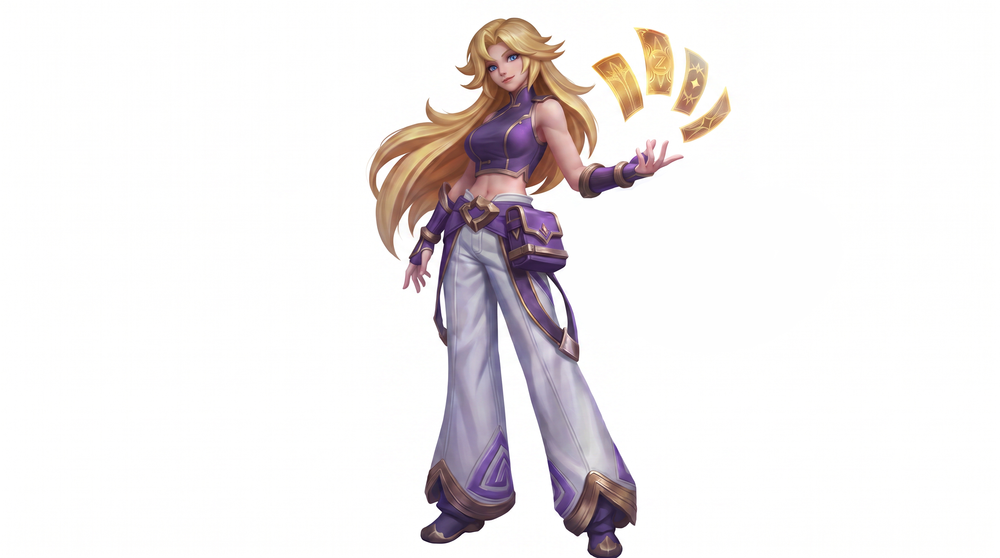
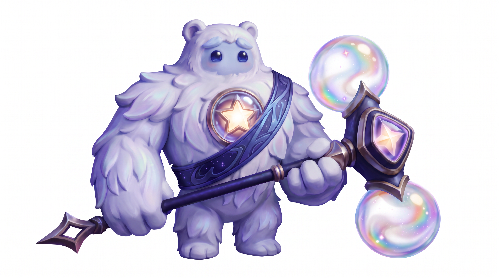
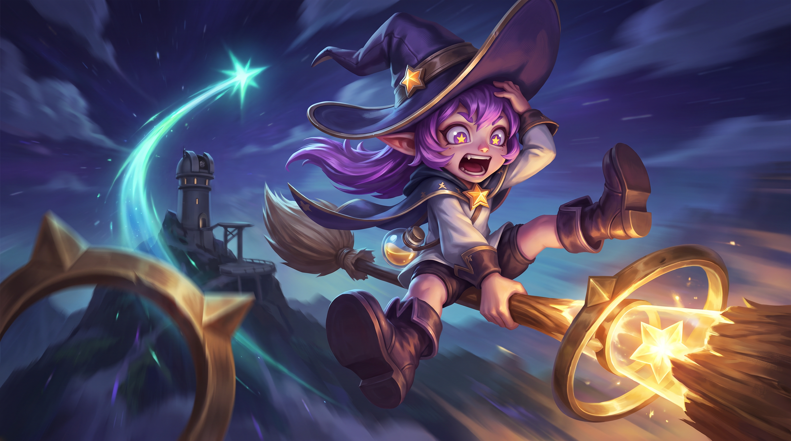
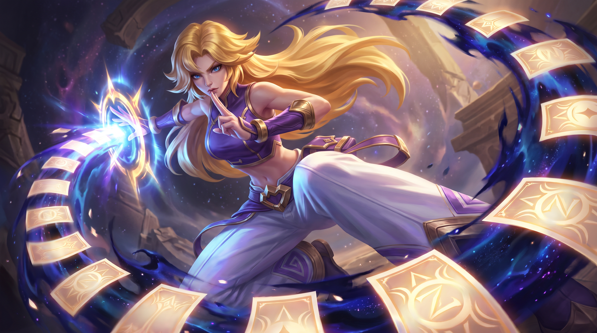
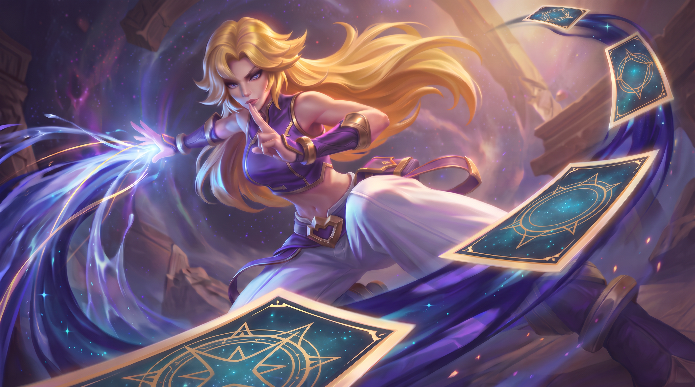

# 2026-08-24 项目总交接：五角色、美宣与出场动画

> 这是公司 Codex 的第一阅读入口，汇总 2026-08-21 至 2026-08-24 家中 Codex 的有效进度。旧文档保留为历史，但冲突时以本文为准。

更新时间：2026-08-24（Asia/Shanghai）

当前阶段：五名角色母版已经形成；正在逐名制作 16:9 横版英雄式卡通奇幻 MOBA 美宣，并把美宣作为出场动画的英雄姿态节点。当前工作停在波姆美宣的构图重设计，尚未定稿。

## 1. 五分钟接管摘要

### 已确认事实

- 五名角色是米露卡、奈纱、佩可、砚秋、波姆。
- 五张当前角色母版已永久保存到 `assets/character-masters/`，不要再依赖临时剪贴板路径。
- 美宣目标不是白底角色立绘，而是带故事瞬间、前中后景、大透视和明确光源的 16:9 横版叙事美宣。
- 用户要的是可迁移的“成熟英雄式卡通奇幻 MOBA”视觉语法，不是复制任何现有游戏角色或官方原画。
- 用户不喜欢过度详细的提示词。过长限制会让模型平均执行，反而丢失构图主次。
- 图像输入命名固定：图1是角色身份母版，图2是构图/氛围参考。
- 波姆的氛围方向已经锁定：瀑布秘境、梦幻治愈、生命被吸引、温柔守护；问题只在构图、动感和武器结构。

### 尚未确认或无法从仓库核验

- 当前仓库没有奈纱和佩可的最终美宣文件，不能仅凭聊天印象把它们标为定稿。
- 米露卡与砚秋保留的是关键候选/修图节点，不等于用户已最终验收。
- 波姆三张美宣全是迭代记录，没有一张最终通过。
- 出场动画、专属转场、待机循环和五角色声音仍处在方案阶段，尚未生成最终视频或音频资产。

## 2. 当前角色母版

| 角色 | 当前母版 | 身份与关键结构 |
|---|---|---|
| 米露卡 Miluka |  | 星裔小魔女；巨大不对称星空帽、星形瞳孔、魔杖、飞行扫帚、星谱瓶；聪明、爱研究、爱闯祸。 |
| 奈纱 Nysha |  | 夜绡族女性忍者；深靛高马尾、长围巾遮嘴、背后一把带鞘太刀、普通尺寸苦无；安静、害羞、警觉。 |
| 佩可 Peko |  | 娇小猫灵炮手；猫耳猫尾、棕色短发、护目镜、手提式大型星晶炮；热情、碎嘴、胆大。 |
| 砚秋 Yanqiu |  | 人族星墨符术师；金色长发、蓝眼、紫白金服装、直筒阔腿裤、腰间符箓包、四张实体符箓；沉稳可靠、隐藏好胜。 |
| 波姆 Bomu |  | 大型白毛守护者；淡蓝面部、圆耳、深蓝大眼、星空肩带、胸前星核；双星槌有一根连续长柄、中央星形槌体和正好两颗虹彩星云球。 |

角色体型顺序仍为：佩可最小；米露卡适中；奈纱略高于米露卡；砚秋第二高；波姆最高、最宽、总体型最大。

## 3. 美宣开发状态

### 米露卡：新型扫帚失控试飞

故事方向已确认：米露卡在山顶观星台外试飞自己研发的新型扫帚，星轨稳定环突然失衡。她惊吓又兴奋地沿纵深轴冲向镜头，观众要读出“糟了”和“它真的飞起来了”。

当前较好的构图候选：

有效结论：极低机位、超广角、明显镜头翻滚、扫帚沿 Z 轴冲向观众、前景裁切和强受力。失败模式是侧面平飞、完整站姿、重复扫帚结构、平均柔光和儿童手游塑料感。

状态：方向和关键构图已建立；仓库中没有最终验收记录。

### 奈纱：暗处现身

已建立的故事方向：观众像刚发现她藏在屋脊或暗处；前景遮挡压缩空间，苦无逼近镜头，她本人仍向后收拢。她应显得低调、害羞而警觉，不是凶狠刺客。

状态：角色母版已保存；最终美宣文件尚未在仓库核验。

### 佩可：巨炮后坐力

已建立的故事方向：巨炮炮口占据极近前景，佩可被后坐力带得腾空；强广角、大透视、较大倾角，表情自信兴奋，体现娇小身体与巨炮的反差。

状态：角色母版已保存；最终美宣文件尚未在仓库核验。旧双枪图仅是历史探索，最终武器以大型星晶炮母版为准。

### 砚秋：星墨符箓封印

故事方向已确认：符箓沿空间纵深形成不规整的 C 形轨迹，深青、冷蓝、蓝紫星墨伴随符箓流动；人物脸和手是主焦点，符箓与能量只做次焦点。参考构图可借用球体从右后绕向左前的空间节奏，但全部替换成原创符箓运动。

关键节点：

| 初次生成的材质/光效参考 | 后期较接近的构图，但已变软变糊 |
|---|---|
|  |  |

根因结论：反复用后期模糊图继续垫图，会让 Banana 近似复刻模糊质感。应回到清晰母版/首轮清晰图，用文字重建符箓布局；不要同时上传清晰图与模糊后期图。

状态：构图方向接近，但没有最终通过；画面锐度、MOBA 厚涂材质和人物突出度仍需重建。

### 波姆：秘境生命守护者（当前唯一优先任务）

#### 已锁定的情绪与场景

- 故事发生在波姆还生活于自己故乡时。
- 梦幻森林秘境、远处瀑布、溪流或浅水、穿林暖光、被治愈吸引来的小动物和小精灵。
- 波姆像世外桃源的守护神；情绪是温柔、治愈、保护生命，不是战斗、奔跑或跳跃。
- 动感应来自动作扭转、近大远小、环境响应和单条生命光流，而不是让波姆变得好斗。

#### 三张代表性迭代

| 版本 | 画面 | 判断 |
|---|---|---|
| 明亮秘境初版 |  | 氛围治愈、瀑布和生物关系成立；但像柔软童话手游插画，构图太正、动势不足。 |
| 最接近氛围版 |  | 大手近景、暗色森林、远处瀑布和暖光最接近目标；仍是正面举手，树形偏普通，双星槌结构损坏。 |
| 最新失败版 |  | 光带、树根和框景继续堆叠；画面被曲线淹没，双星槌依然错误，不能作为下一轮母版。 |

#### 已确认的失败原因

1. 提示词同时要求藤蔓、盘根、树枝、瀑布、光带、轨迹和飘叶，模型会把全部元素统一生成重复曲线。
2. “增加动感”被错误执行成奔跑或跳跃，破坏温柔守护者定位。
3. 正面站立、双手平举会退化成技能展示立绘，不像被抓拍的故事瞬间。
4. 一次生成同时要求强构图、复杂环境、动物群和精确双星槌拓扑，模型无法稳定保住武器。
5. 双星槌不是三球法杖：必须是一根连续深靛长柄、中央星形槌体、正好两颗虹彩星云球。此前生成经常出现第三颗球、分裂槌头或断裂连接。

#### 下一轮待确认构图：动物视角下的守护者

这是当前讨论停点，尚待用户明确批准后再写完整提示词：

- 镜头贴近溪流与小动物，从左下极低机位仰视。
- 波姆不再正面居中站立，而在画面右侧俯身向前，胸腔和肩髋有明显扭转。
- 一只巨大手掌伸入左侧近景，接住或治愈一只重新发光的小精灵；脸位于右上主焦点。
- 前景小动物剪影 → 巨大手掌 → 波姆面部 → 左上瀑布天光，形成清楚对角线视线。
- 只保留一侧粗壮树干做画框；不要藤蔓墙、盘根迷宫或多条发光丝带。
- 只使用一条生命光流，并让水珠、少量树叶和精灵共同响应。
- 双星槌斜靠在波姆身后右边缘，槌头朝下、柄朝上；大部分槌头裁出画外，只显示连续长柄和少量可信结构，避免武器抢焦点和再次长出第三颗球。
- 荷兰角约 10°，动感主要来自极低机位、近景手掌、身体俯身扭转和前中后景尺度差。

## 4. 提示词工作流

继续生图时使用本地两个 Skill：

- `heroic-fantasy-moba-keyart`
- `cinematic-prompt-director`

但输出应遵循用户的实际偏好：先给短设计，获得方向认可后再给完整提示词；完整提示词仍要简洁，只保留最高影响的视觉决定。

推荐顺序：

1. 图1上传对应角色母版。
2. 图2最多上传一张构图/氛围参考。
3. 先写角色身份锁定、一个故事瞬间、一个镜头骨架、一个主光、一个次焦点。
4. 禁止项只写最可能复发的三至六项。
5. 第一次先验证构图与动作，不要求武器所有微小结构同时完美。
6. 若整体通过但武器坏，单独局部修武器；若整体连续三轮失败，回到母版重生，不再叠加旧失败图。

本地英雄联盟图库中已使用过的构图/氛围观察对象包括 `015_Bard.jpg`、`029_Galio.jpg`、`004_Akshan.jpg` 和 `horace-hsu-yunara-render-f-leg.jpg`。这些只提供镜头、动势、明暗与空间参考，不应上传到本仓库或复制其角色设计。

## 5. 出场动画、转场、待机与声音方案

### 已形成但尚未制作的统一结构

1. 出场动画约 6.5 秒：环境揭示 → 标志动作与第一句短台词 → 能力/性格展示 → 收束到美宣姿态。
2. 美宣姿态稳定约 0.4 至 0.6 秒，不应突然冻结。
3. 角色专属遮罩转场约 0.9 秒：专属武器、徽记或能力元素冲向镜头并完全遮挡，遮挡期间切换场景。
4. 待机页落稳后进入 6 至 8 秒无缝循环，只保留呼吸、眨眼、头发、衣摆和武器能量等微动作。
5. 待机说话应作为独立事件动画，从待机姿态进入、说完再返回；不能把台词烘焙进无限循环。

### 声音方向

- 计划使用 VoxCPM2 先做无参考音频的 Voice Design 探索五种声线。
- 选中满意声线后保存为角色声音母版，再用可控克隆保持音色一致并改变情绪、语速和表演。
- 有口型的出场台词应先生成声音，再让视频模型参考音频；纯遮罩转场和基础待机不需要提前生成对白。
- 目前没有最终声音母版、最终台词或音频文件。

## 6. 下一次公司 Codex 的正确动作

1. 先向用户复述波姆“动物视角守护者”构图，确认是否批准；不要未经确认直接写新长提示词。
2. 批准后输出一版精简的 Banana/GPT Image 高控制提示词；若用户明确需要 Midjourney，再补 MJ 版。
3. 第一轮只验收：动物视角、巨大近景手掌、波姆俯身扭转、瀑布天光、单条生命光流和安静治愈感。
4. 双星槌只作为右侧局部剪影；若模型仍生成三球或断柄，整体构图通过后再单独局部修理。
5. 波姆美宣通过后，再回到五名角色的最终资产盘点：每人必须有母版、美宣终稿、出场动画、遮罩转场、待机循环、声音母版与台词表。

## 7. 相关 Codex 任务

- `codex://threads/01a02f5c-8cb3-7a10-8255-ec62a4f9b92c` — 开始制作波姆美宣图（当前主任务）
- `codex://threads/01a02b2d-6ae4-75a3-8479-e94ff65af4e4` — 五角色横版美宣首帧提示词
- `codex://threads/01a02d56-288e-7fa2-a067-09a541dcfb08` — 设定砚秋美宣图提示词
- `codex://threads/01a02fba-a0d3-7150-9b4f-62165050766b` — 设计角色出场与待机动画
- `codex://threads/01a024eb-19d8-7470-9ff9-0252d2f6b486` — 生成奈纱美宣提示词/角色方向
- `codex://threads/01a02460-1444-7df2-90a3-9f550d5280fb` — 设计米露卡、砚秋形象
- `codex://threads/01a024ea-09c8-7ce2-b56d-12c0c5bc53ad` — 设计佩可形象
- `codex://threads/01a029f4-33e7-7b82-9de3-6f6ac873de07` — 设计波姆形象
- `codex://threads/01a02870-e280-75f1-aea3-5eaa464f5e69` — 设计砚秋形象

## 8. 历史文档使用边界

- `CHARACTER_VISUAL_HANDOFF_2026-08-21.md`：角色母版形成前后的详细实验历史，可查旧提示词和米露卡早期图。
- `CHARACTER_MJ_HANDOFF_2026-08-20.md`：更早的群像和单人探索，含已被推翻的角色设定，只用于追溯。
- `GAME_DESIGN_HANDOFF.md`：游戏玩法、AI 图片/视频资产限制和首版闭环，不是当前角色视觉事实源。

不要恢复这些旧结论：佩可最终双枪、奈纱“夜丝族”或短发、砚秋符册、波姆焦糖胖熊/短柄重槌、五人群像直接定稿。
