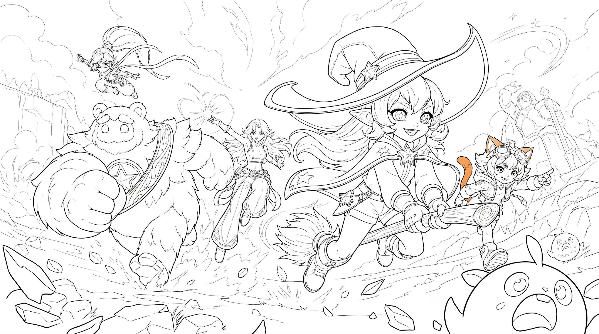

> 历史记录：请先读 [2026-09-07 当前项目交接](HANDOFF_2026-09-07_CURRENT_ART_AND_UI.md)。本文件原有“当前/已锁定/最高优先级”不覆盖用户最新说明；仅按需追溯，勿据此自动恢复旧方案。

# 2026-08-31 当前对话完整交接：加载动画 → 浮空岛 → 动态群像 → 线稿细化

> 本文是当前视觉制作任务的最新入口。玩法与 UI 的既有决策继续参考 08-28 文档；本对话没有完成跑酷程序，也没有重新确认移动方式。用户已经主动恢复视觉制作，不能再用旧文档的“唯一第一步是问跑酷移动方式”阻止当前线稿工作。

## 1. 一分钟接管与准确停点

- 当前制作对象是**五人向镜头冲来的动态群像**，不是四人佩可持炮分支，也不是五人背影浮空岛分支。
- 米露卡位于右侧最前景，跨坐木扫帚、双手握柄；波姆左前景挥拳奔跑；砚秋中央；奈纱左上腾空；佩可右侧中后景奔跑。
- 用户明确说“修好了”的是米露卡骑乘修改。不要扩大成所有细节、武器、整幅画已最终验收。
- 彩稿已转出初始线稿；用户要求细化，助手已经给出全文，**尚未收到细化结果与用户验收**。
- 当前用户授权的任务是同步全部对话与交接，不是继续生图、改图或开发游戏。
- 下一次继续：先看用户提供的细化结果；若尚未生成，先处理下述“保图 vs 补武器”冲突，再使用精修提示词。不要直接跳到上色。

### 当前资产

| 资产 | 状态 |
|---|---|
| [修正骑乘后的彩稿](../assets/handoff/2026-08-31-keyart/current-color-broom-fixed.jpg) | 原文件 nano-ai-1788115469875_5MB内.jpg；用户确认骑乘修好 |
| [初始线稿](../assets/handoff/2026-08-31-keyart/current-lineart-initial.png) | 原文件 nano-ai-1788116113813.png；待精修 |
| [本轮五套四视图与四张单人参考](../assets/handoff/2026-08-31-keyart/references/) | 本轮原样归档，不覆盖旧 character-masters |
| [全部资产来源、状态、SHA-256](../assets/handoff/2026-08-31-keyart/manifest.json) | 14 个二进制文件，源文件与副本哈希核对 |

## 2. 所有对话与提示词在哪里

- [可恢复对话原文 TRANSCRIPT.md](conversations/2026-08-31-keyart/TRANSCRIPT.md)：197 条按记录顺序导出的用户/助手可见消息，包含本次同步开头两条进度。后续同步执行过程和本次推送回执不在该快照内。
- [机器可读 messages.json](conversations/2026-08-31-keyart/messages.json)：同一批消息全文，不是摘要。
- [消息索引](conversations/2026-08-31-keyart/INDEX.md)：按编号定位。
- [全部被文字引用的附件路径](conversations/2026-08-31-keyart/ATTACHMENT-PATHS.json)：148 个路径字符串及同步时存在性；斜杠不同的同一路径可能重复，不等于148张不同图片。
- [18份关键提示词和原话全文](prompts/2026-08-31/README.md)：精修、提线、骑乘、动态群像、背影群像、浮空岛、完整故事与分镜建议。

原文来自当前任务 `01a0497b-4807-75d0-83a1-74c17f482696` 的本地会话记录，跨越08-29起的历史。不是所有其他任务的全量导出。排除内部推理、系统/开发者指令、工具日志、环境注入、图片base64；保留用户可见正文与附件路径。原始约551MB运行日志不上传。

**历史原文含助手错误、过时建议、未核验的平台能力说法，保留原文不等于认可。** 源时间戳是UTC记录时间，不能据此反推图片的真实生成时间。没有把所有历史截图或视频上传；外部游戏参考图仍不上传。附件存在但不在manifest中即未归档。

## 3. 本对话完整阶段与方向变更

### A. 恢复加载页第一镜（消息001–078）

用户要继续镜头资产，不是编写网页。平台只有上传图片＋输入提示词，没有蒙版；用户称后续改图覆盖前版，所以必须本地保存版本，不能假定平台可以回退。

甲虫镜头曾反复尝试：保持低机位、横向道路、路边宽叶、幻想倾斜石脊；清理山草石头的杂乱细节，建立前中远层次。失败包括：过度减法变剪纸、重画山谷、黑色巨大草叶框死两侧、远山变尖塔、随意新增瀑布、白雾、近景写实碎纹。

视频节点3/4有测试记录，未通过整镜验收。反馈包括匀速漂浮、摄影机视差不足、动作三段机械切换、米露卡入场没有铺垫及空间关系不成立。6秒只是一段测试，不是完整开场总长；时间必须明确写成连续区间，不能无说明改成8秒。

曾提出A/B/C关键帧：飞行、落叶、鼻子以上平视探头，共享场景、叶片、机位和光源。灰模/深度示意可作辅助，不是真实精确深度数据。该流程没有完成全套可用关键帧。

### B. 用户重新明确完整世界观开场（消息079–084）

[用户完整叙事原话](prompts/2026-08-31/079-user-full-opening-story.md)是最重要事实源，不能再次缩成只有6秒甲虫镜头。

已明确叙事顺序：

1. 摄影机跟随甲虫飞行，甲虫停在路边叶片上。
2. 保持虫视角；米露卡从画面下方缓慢、小心探头，仅露鼻子以上，眼睛与甲虫平视，好奇观察。
3. 转到侧面，露出米露卡完整蹲姿；她因观察甲虫而落后小队。
4. 前方打闹声吸引她，她转头看向其他四人，机位与视线衔接。
5. 转四人侧面：佩可逗奈纱，奈纱无奈；后面的砚秋温柔无奈地笑并摇头；最后的波姆憨厚地笑。
6. 镜头拉高，米露卡起身追赶，一行五人进入洞穴。
7. 再拉高旋转，五人陆续从悬崖洞口出来；背对摄影机望向云海、浮空岛、远山、悬崖下村庄的崭新世界。
8. 游戏Logo在画面中央浮现。

助手建议过28秒，也建议过22–24秒完整版＋6–8秒普通加载循环；**均不应写成用户已锁定时长**。用户后来明确“为了进度，先别搞这么长的开场动画”，未来可能再做，所以完整开场目前暂停、未完成。

### C. 先做世界观静帧：悬崖背影与远景浮空岛（消息084–130）

用户转向代表世界的一张图。最终方向：超大全景；五人很小，在右侧、中线以下的悬崖平台，不能贴到画面最底边；世界远大于人物。去掉洞窟框景与巨树。中景留给云海与空气，浮空岛全部在远景，其中一座有辨识度的主岛与更小卫星岛，不能像连续山脉或贴脸巨岛。

上午9–10点，明亮蓝天、暖白云、清爽青绿；太阳在画外，只产生光照，不出现巨大太阳圆盘。光影可以强，但不要灰蒙蒙或大片纯黑。

MJ阶段用户明确偏好：**文生图＋风格参考，不把每轮不稳定的MJ结果反复当下一轮图像输入**。细节修复和角色合成再交给编辑模型。风格化效果与结构准确性必须分开验证，高清放大不等于结构修复。

消息125用户说“终于抽出来一个满意的”，归档为[满意环境构图](../assets/handoff/2026-08-31-keyart/history/approved-environment-composition.png)。这不代表图中占位人就是最终五角色。后续还去掉人物并高清处理，用户仍指出草、石结构和细节密度有问题；没有最终背影角色合成验收。

### D. 五人背影角色母版与3D导演台（消息130–169）

- 白底是明确要求：纯白无缝背景，便于抠图合成，不继承黑色素体舞台、名字、标尺。
- 用户明确体型排序：波姆最高最大 → 砚秋 → 奈纱 → 佩可 → 米露卡。小型角色不能统一拉成长腿成年人。
- 必须背对摄影机，匹配环境的后侧轻俯角，不能用正面群像参考诱导出正脸。
- 不要平均排队、站位间距过大、波姆卡中央变白墙、全员并腿垂手；需要自然pose和共同视线。
- 用户制作[3D素体导演台](../assets/handoff/2026-08-31-keyart/history/director-blocking.jpg)：紫=米露卡、蓝=砚秋、黄=波姆、红=奈纱、绿=佩可。
- 用户明确“按我这个站位”，助手不能擅自换位。素体只控制站位、相对大小、前后遮挡与机位，**不控制僵硬动作**。
- 失败：米露卡踩/跳到砚秋手上、角色位置漂移、奈纱抓刀、群像变展示柜。
- 后来改只垫五套四视图，以文字描述站位；一版pose用户认为不错，但角色被改成细长二维形态，需要恢复母版身份。未见最终合成验收。

### E. 正面高速群像分支（消息170–188）

从背影世界观静帧转向明亮峡谷中的高速英雄群像，不要把两者的机位和站位混在一起。

先出现奈纱前景的五人替换稿，随后用户要求米露卡骑扫帚成为最前景。另有佩可持巨炮最前景的**四人分支**（无米露卡），用户给红色批注定位。批注是给助手看的，不是让用户把红字红圈垫入模型。

四人佩可分支中的武器：单炮口铜金火炮，不能复制参考图多管枪；母版只控制武器外观，不能把单人展示pose原样放大。动作强调后坐力、肩髋反扭、双腿分离、炮口和鞋底前冲。该分支是历史实验，不覆盖最新米露卡五人群像。

随后用户展示最新五人图，认可张力，但指出米露卡踩扫帚；要求真正骑坐、双手握柄。助手提供局部修正；用户后来明确修好了。

### F. 彩稿 → 线稿 → 精修（消息189–194，当前）

用户提供教程流程：提取线稿并细化 → 从原图提取扁平色稿 → 反推专业中文提示词 → 以线稿结构加色稿颜色重构图像。

目前仅完成：已有彩稿；已生成初始线稿；已交付线稿细化提示词。**扁平色稿、最终重构提示词、重新上色与验收均未完成。** “任何平台都能克隆效果”只是教程中的说法，不是已验证能力或应作出的保证。

## 4. 当前身份与内容锁定

| 角色 | 本轮身份重点 | 当前图内容与注意项 |
|---|---|---|
| 米露卡 | 约3.5头身、尖耳、紫发、星瞳、巨大金边女巫帽、披风、白上衣、深短裤、靴子 | 右前景跨坐木扫帚、双手握柄；不能同时手持魔杖，不踩/站/冲浪 |
| 波姆 | 最高最宽、圆耳、白毛、蓝脸、大眼、星徽、星空斜肩带 | 左前景毛绒拳头与奔跑；不机械化，不把旧单人双星槌自动加回来 |
| 砚秋 | 6头身、金发蓝眼、紫色无袖上衣、宽白裤与紫金边 | 当前图为抬手施法；母版武器是四张符卡，但当前彩稿/初始线稿并未清楚展示四卡 |
| 奈纱 | 4头身、紫色高马尾、面巾、忍者服、银护甲、围巾 | 本轮武器母版是一把收鞘忍刀＋一枚手持苦无＋三枚备用苦无，不是双刀；当前远处细节需核验 |
| 佩可 | 4头身、猫耳尾、棕发、护目镜、红外套、白短裤、厚底靴 | 当前图空手奔跑/指向前方；单人母版有巨炮，不应在清线时自动添加 |

最新本轮参考与旧 character-masters 有差异时，保留两个来源与状态，不能静默覆盖全项目角色设定。英文名历史有 NASHA/NAISHA/NYSHA、PEKE/PEKO 等拼法，尚无本轮统一命名决定。

## 5. 最新精修提示词结构和使用警告

[消息194精修全文](prompts/2026-08-31/194-lineart-refinement-original.md)已原样归档，顺序为：

1. 只细化、不改构图与五人身份。
2. 整体线稿：纯白底、清线、三级线重、去除佩可耳尾橙色残留。
3. 结构修复：手指、关节、遮挡、抓握接触。
4. 米露卡：帽檐层次、星饰、发束、衣物、真实跨坐、双手握柄、木纹与帚毛。
5. 波姆：毛束分层、眼睛、胸徽、肩带、拳头结构。
6. 砚秋：脸发、衣服、双腿宽裤、施法手和符卡。
7. 奈纱：面巾、高马尾、围巾、护甲与装备。
8. 佩可：耳尾去色、护目镜、衣服、奔跑手势和靴子。
9. 环境特效：远景轻、主体重，云烟魔法不机械描边。
10. 禁止项和交付标准。

### 必须纠正/先确认的冲突（本次核对发现，不静默改写历史）

- **原文要求“所有内容不变”，又要求补四张符卡和准确苦无数量。** 这些不是当前线稿里已经清楚存在的内容。若用户只要线稿细化，默认不新增道具；需要恢复设定武器时应明确列为额外内容修改并取得确认。不能把助手提出的补卡当作用户批准。
- **线稿原文同时允许深灰线条又要求“不能有灰度”。** 应理解成没有灰色填充、阴影或灰阶渲染；若严格黑白交付，线条层次由粗细/疏密表现，抗锯齿边缘不等于灰度上色。
- **佩可在当前彩图里没有火炮，波姆没有双星槌。** 全局身份不等于所有装备必须每张画都入镜。不要为恢复旧母版武器破坏当前已认可构图。
- **旧提示词图号有重号/错号。** “图8既佩可又奈纱”等只能作为历史记录。每次新提示词先建立唯一输入图清单，按实际上传排序，不能照抄旧图号。
- **“不要任何星空披风/米露卡”只属于四人分支。** 当前五人图必须保留米露卡。
- **先前助手把奈纱描述成双刀是错误。** 原文保留但不再执行。
- 当前线稿可见波姆眼部简化、佩可橙色残留。应补眼球/虹膜/高光的轮廓结构与去色，而不是只增加衣服花纹。远景云线与前景小生物的视觉权重也应检查，避免比人物更抢眼。

本次仅标注风险，不擅自宣称已修改原始精修提示词或已经解决画面问题。

## 6. 已定制作原则与提示词模板骨架

- 用户要求完整提示词时，直接给可复制全文，不用长篇讲解替代。用户指定段落结构时沿用该结构，不擅自压缩成不同模板。
- 用户曾明确不喜欢以“任务：这那的”开头，要求用“一张顶级商业级游戏宣传插画……”开头；另一些版本又明确要求照给定“任务”结构。以当次明确要求为准，不把某次偏好永久绝对化。
- 单人母版主要控制武器与身份，四视图控制服装、比例、背面结构；不得照抄母版静态pose。
- 构图图控制机位/空间，素体控制站位/遮挡，风格图控制材质色光；每张输入图职责唯一，不同时争夺构图。
- 技能可辅助专业描述，但用户批准的实际方向优先；不要把技能默认的暗底亮核强加到明亮上午画面。
- 整体动态长提示词结构：开头气质 → 输入职责 → 镜头与环境 → 主体构图 → 各角色身份/动作/武器 → 小生物 → 爆炸地面 → 空间层级 → 色彩 → 光照 → 体型 → 风格 → 运动 → 身份武器限制 → 负面约束 → 构图锁定。
- 修改动作时必须同时更新正文、空间层级、负面约束和最后构图锁定，不能上文要求骑扫帚、下文仍禁止扫帚。
- 高动态不是只把近景人物放大，而是受力、肩髋扭转、前后腿分离、极端缩短与方向一致的衣发拖拽。
- 不把助手自己的主观评分、镜头度数估计、模型能力断言写成已验证客观事实。后续需要平台参数时再核验。

## 7. 下一步与所有未完成事项

### 当前顺序（不代表本次已执行）

1. 接收/查看细化线稿；没生成则先决定仅清线还是同时补武器，按上节修正冲突。
2. 验收五人位置和身份、米露卡跨坐与双手、脸眼手结构、毛发线条、衣物遮挡、去色、远近线重。不要一轮加满纹样。
3. 线稿通过后，基于已确认彩稿提取扁平色稿：只锁大面积固有色与区域分配，不把高光/光晕烘焙成固有色。**适配本图的色稿提示词尚未写。**
4. 从原彩图反推最终重构中文提示词：保留晴朗上午、峡谷草原、强纵深、五人主次、厚涂CG体积和材质差异。**最终重构提示词尚未写。**
5. 用验收线稿控制结构、色稿控制颜色；如需原彩稿作光影参考，清楚划分第三张图职责。先检验是否重新漂移构图/骑乘，再做局部修复。
6. 最终彩稿通过后再决定它用于加载页、宣传图或后续动画；不能默认当前动作群像已经替代全部世界观素材。

### 保留但未完成/暂停

- 完整世界观开场：分镜、关键帧、角色互动、洞穴转场、世界揭示、Logo叠加、音效、剪辑和循环均未全套完成。
- 甲虫第一镜：测试视频有改进，但未最终通过；不继续让未验收底图直接承担完整视频任务。
- 浮空岛背影静帧：满意环境已有；五角色身份恢复、pose及最终合成未确认。
- 四人佩可前景分支：动作提示词存在，不是当前定稿。
- 当前动态五人图：线稿细化未验收、色稿未做、最终上色未做。
- 全项目Logo、角色选择UI、跑酷闭环、出场/待机视频与声音：沿用既有交接的未完成状态；本对话没有替它们完成开发或验收。

本地还存在 nano-ai-1788116740541.png、nano-ai-1788117079642.png 等后续文件，但用户未在本次对话确认其用途或结果，本次不导入为已验收版本。

## 8. 同步与安全边界

- 仓库：MianTiaoDW/week-1-game-development；沿用现有默认分支 codex/music-game-design-handoff。
- 只提交本次交接、会话可见原文、提示词提取、关键资产、索引脚本和入口修订。
- 保留既有未跟踪08-28 UI稿与08-29目录，未自动加入提交。
- 不上传外部游戏参考图库、PSD、视频、整个临时目录或运行日志。
- 文本安全检查未发现常见明文凭据格式；这不是对全部历史陈述真实性或完整隐私的保证。正文仍保留用户提供的本地文件路径用于追溯。
- 同步完成须以Git提交、推送结果和远端提交哈希为证，不以“已写文件”冒充已上传GitHub。

## 9. 下次开场可直接复制

> 先读 docs/HANDOFF_2026-08-31_KEYART_AND_LINEART.md。本任务当前是五人高速群像的线稿细化，不是四人佩可持炮，也不是背影浮空岛，更不是恢复长开场。米露卡骑扫帚已修好；初始线稿已生成；精修提示词已交付但结果未验收。先看用户最新细化图，检查双手跨坐、五角色身份、佩可残留颜色、波姆眼睛及线条层级。不要擅自添加原图没有的符卡/武器；线稿通过后才提取色稿并反推最终上色提示词。完整历史和原始提示词均可按消息编号查阅。
